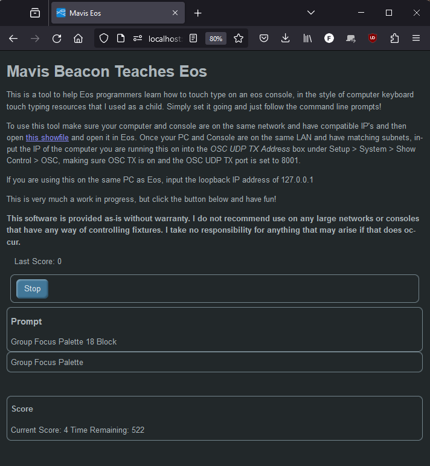

Mavis_Eos
=========

### About

This project was created to assist ETC Eos programmers with learning the positions of the keys on ETC Eos lighting desks (that helpfully keep moving between generations). I built this to build up my confidence - I prefer accuracy over speed when programming and have a habit of looking down to make sure I'm hitting the right keys in work environments. This was built to allow me to practice and build up my confidence that I'm right without looking at the keys in a low stress environment.

### Features
The software generates random Eos syntax, and displays them on a local webpage for the user to view and type into the Eos desk. When used with the included showfile, the syntax is sent back to the software to check your response, and if it is correct one point is added to the score. Five points are removed for any incorrect response.

### Compatiblity
This project does not require any ETC hardware, or any licenses. This means that you can practice using any ETC desk that can run the (non-legacy) .esf2 showfile, or just use the Windows/Mac EOS software on the same PC as the project, allowing you to practice with hotkeys or LXkeys type hardware. The only limiting factor may be that the showfile is quite large for Eos (10mb), so can take a while to load.

### UI Example

## Installation
 1. Follow [this guide](https://nodered.org/docs/getting-started/local) on how to install Node Red for your system.
 2. Once installed, use the command `node-red` in a terminal or command line window to start Node-Red.
 3. Navigate to http://127.0.0.1:1880
 4. Close (or follow) the tour, and then click clone repository. Change your name and email if you'd like, however these are only used if you want to contribute to the project and upload changes.
 5. Type `mavis-eos` into the project name window, and input this link: https://github.com/tobyriding/mavis-eos as the git repository URL. Ignore all the other options and click Clone Repository at the bottom. 
 6. At this point the project files will be copied to your computer, but you will still be missing dependencies. Click the Manage Dependencies button and click all the small install buttons. Wait for them all to show as installed.
 7. Navigate to http://127.0.0.1:1880/maviseos and follow the instructions to link your Eos to the software!

## A Note
Please don't use this on any live, large, or show networks. No damage should be caused if you do so but this a personal project, I don't know any cybersecurity best practices, and so therefore this software is not designed to be secure or particularly stable.
This software probably doesn't work perfectly, and could be more complex, but I've decided to get a simple version published in case I lose interest/become too busy to continue working on it.

### Known Issues
 - The software doesn't keep track of the actual status of the desk at the moment (just the command line) and is entirely random and so it will occaisonally ask you to select active just after you set all channels to 0 meaning there are no fixtures selected. Fix: Type any random command in to fail the prompt and continue.
